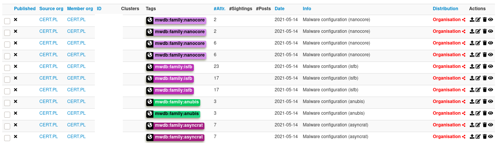

# karton-misp-pusher

Listens for new samples in the [karton](https://karton-core.readthedocs.io/en/latest/)
pipeline and uploads them to MISP.

Configs are parsed using the [mwdb-iocextract](https://github.com/CERT-Polska/mwdb_iocextract)
project. This means, that we operate on a higher level than raw JSON configs, and makes
it possible to correlate different samples and campaigns (for example, by the used crypto
material).

**Author**: CERT.pl

**Maintainers**: msm

**Consumes:**
```
{
    "type": "config",
}
```

**Result:**



## Usage

First of all, make sure you have setup the core system: https://github.com/CERT-Polska/karton.
[More info here](https://github.com/CERT-Polska/karton/blob/master/docs/how-to-run.md).

Then install karton-misp-pusher from PyPi:

```shell
$ pip install karton-misp-pusher

$ karton-misp-pusher --misp-url https://misp.url --misp-key SECRET123
```

You can also add optional xrefs to mwdb with `--mwdb-url`, or skip MISP
verification with `--misp-insecure`. For more options see `--help`.


